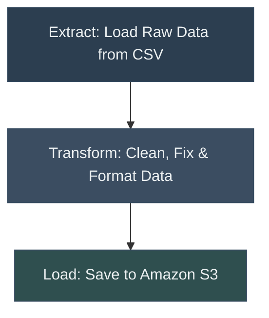

# 🎬 **Movies Data Pipeline Challenge**

**Problem**: Messy, inconsistent datasets make it difficult to derive meaningful insights or use the data effectively.

**Goal**: Transform a raw movie dataset into a clean, standardized format and store it in Amazon S3 for future use.

This project is a great opportunity to practice data cleaning, Python workflows, and integrating cloud storage with AWS S3.

### Movies Pipeline Flow (ETL)

## 📥 **Getting the Data**

You have two options to access the dataset:

- **Download from Kaggle**:  
  [Movies Dataset for Feature Extraction](https://www.kaggle.com/datasets/bharatnatrayn/movies-dataset-for-feature-extracion-prediction)

- **Download from the Repo**:  
  The dataset is included in the `datasets` folder in this repository as `movies.csv`.

## ⚙️ **Your Challenge**

### **Load the Dataset**
- Load the `movies.csv` file into a Pandas DataFrame.  
- Preview the first few rows of the dataset to understand its structure.

### **Clean and Process the Data**

- **Standardize Column Names**:  
   - Ensure column names are consistent.   

- **Explore and Clean Text Columns**:  
   - Inspect the text-based columns for formatting issues.  
   - Clean up unwanted spaces, newlines, special characters, or repetitive labels.  

- **Fix the 'Year' Column**:  
   - The `year` column is messy. Extract the 4-digit year from the data.  
   - Convert it into integers and decide how to handle any missing data.  

- **Clean Numeric Columns**:
   - Identify and fix formatting issues.  

- **Handle Missing Values**:  
   - Review all columns for missing values.  
   - Decide whether to fill, drop, or leave them as `NaN`.  

- **Inspect and Drop Unnecessary Columns**:  
   - Identify columns that don’t add value.  
   - Justify your decision before removing any column.  

- **Remove Duplicate Rows**:  
   - Check for and remove any duplicate rows.  

### **Upload the Cleaned Dataset to S3**
- Save the cleaned dataset as a CSV file.  
- Upload it to your **own S3 bucket** using the `boto3` library.  
- Use a `.env` file to securely store your credentials and S3 bucket information.  
- New to AWS S3? [Get started with Amazon S3 here](https://aws.amazon.com/s3/getting-started/).
- Alternatively, you can load the dataset to a [sqlite database](https://www.geeksforgeeks.org/python-sqlite/).

## 🏆 **Bonus Challenge** (Optional)

### Add Logging for Key Steps

Use Python's `logging` library to log to a file called 'pipeline.log'. This log should include:

- When the dataset is loaded successfully.  
- How many rows and columns were loaded.  
- When data cleaning starts and ends.  
- Number of duplicate rows removed.  
- Confirmation that the cleaned dataset was uploaded to S3.  

⚠️ **Avoid overlogging**: Skip logging every minor operation, like cleaning individual columns. Focus on high-level steps to keep your logs clean and useful.

## 🚀 **Next Steps**

Once you’ve completed the challenge:  
- Share your cleaned dataset and code on Github 
- Reflect on what you learned and where you would improve.  
- Write documentation for your repo.
