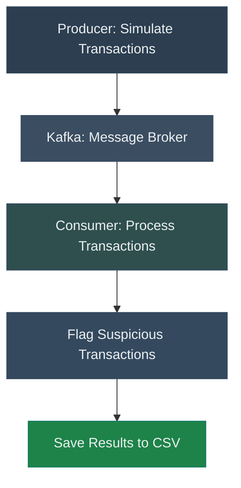

# ⚡ **Kafka Fraud Detection Pipeline Challenge**

**Problem**: In today’s fast-paced digital world, real-time transactions are everywhere. Detecting and addressing suspicious or fraudulent activity as it happens is crucial to prevent financial losses and build customer trust.

**Goal**: Use Kafka to:
- Simulate real-time transaction data.
- Process transactions to detect suspicious activity.
- Save flagged and processed transactions for further analysis.

## **Pipeline Flow**




## **Overview**

This challenge involves:
1. Setting up Docker and Docker Compose to run Kafka and Zookeeper.
2. Writing a Kafka producer to simulate real-time transaction data.
3. Writing a Kafka consumer to process transactions, flag suspicious activity, and save results.


## **📦 Step 1: Set Up Docker and Docker Compose**

In this step, you will install Docker and Docker Compose, then use `docker-compose` to set up Kafka and Zookeeper.

### **What You Need to Do**

1. **Install Docker**:
   - Follow the official Docker installation guide for your operating system:
     - <a href="https://www.docker.com/get-started" target="_blank" rel="noopener noreferrer">Get Docker</a>

2. **Verify Docker Installation**:
   - After installing, run the following command to ensure Docker is installed:
     ```bash
     docker --version
     ```
   - Example output:
     ```plaintext
     Docker version 24.0.2, build cb74dfc
     ```

3. **Install Docker Compose**:
   - Docker Compose is included with Docker Desktop on Windows and macOS. For Linux, install Docker Compose using the instructions here:
     - <a href="https://docs.docker.com/compose/install/" target="_blank" rel="noopener noreferrer">Install Docker Compose</a>

4. **Verify Docker Compose Installation**:
   - Check if Docker Compose is installed:
     ```bash
     docker-compose --version
     ```
   - Example output:
     ```plaintext
     Docker Compose version v2.17.3
     ```

## 📦 Step 5: Set Up Kafka and Zookeeper

To start working with Kafka and Zookeeper, you’ll use Docker Compose. Below is the provided `docker-compose.yml` file, which defines all the necessary services, including Kafka, Zookeeper, a producer, and a consumer.

---

### **Provided `docker-compose.yml` File**

```yaml
services:
  # Zookeeper service - Manages and coordinates the Kafka cluster
  zookeeper:
    image: confluentinc/cp-zookeeper:latest
    container_name: zookeeper
    ports:
      - "2181:2181"  # Expose Zookeeper on port 2181
    environment:
      ZOOKEEPER_CLIENT_PORT: 2181
      ZOOKEEPER_TICK_TIME: 2000  # Basic Zookeeper configuration

  # Kafka service - The message broker for the pipeline
  kafka:
    image: confluentinc/cp-kafka:latest
    container_name: kafka
    ports:
      - "9092:9092"  # Expose Kafka broker on port 9092
    environment:
      KAFKA_ZOOKEEPER_CONNECT: zookeeper:2181  # Connect Kafka to Zookeeper
      KAFKA_ADVERTISED_LISTENERS: PLAINTEXT://localhost:9092  # Make Kafka accessible on localhost
      KAFKA_OFFSETS_TOPIC_REPLICATION_FACTOR: 1  # Set replication factor to 1 for simplicity
    depends_on:
      - zookeeper  # Ensure Zookeeper starts before Kafka

  # Producer service - Simulates transactions and sends them to Kafka
  producer:
    build:
      context: .  # Use the current directory as the build context
    container_name: producer
    command: python scripts/kafka_producer.py  # Run the producer script
    depends_on:
      - kafka  # Ensure Kafka starts before the producer

  # Consumer service - Consumes transactions from Kafka, processes them, and saves to CSV
  consumer:
    build:
      context: .  # Use the current directory as the build context
    container_name: consumer
    command: python scripts/kafka_consumer.py  # Run the consumer script
    depends_on:
      - kafka  # Ensure Kafka starts before the consumer
```

6. **Start Kafka and Zookeeper**:
   - Run the following command to start all services defined in your `docker-compose.yml`:
     ```bash
     docker-compose up -d
     ```

7. **Verify Services**:
   - Use the following command to ensure containers are running:
     ```bash
     docker ps
     ```
   - You should see containers for both `zookeeper` and `kafka`.


## **🔨 Step 2: Build the Kafka Producer**

### **Goal**: Create a producer to simulate transactions and send them to Kafka.

#### **Tasks**
1. **Connect the Producer to Kafka**:
   - Use the `kafka-python` library to connect to the broker at `localhost:9092`.
   - Define the topic name: `fraud-transactions`.

2. **Create User and City Data**:
   - Define a list of cities, each with a name, latitude, and longitude.
   - Generate 100 unique user IDs and assign a random home city to each user.

3. **Write a Function to Generate Random Locations**:
   - Simulate a user’s location:
     - 80% of the time, they stay in their home city.
     - 20% of the time, they are in a random city.

4. **Write a Function to Generate Transactions**:
   - Include these fields:
     - `user_id`: Random user ID.
     - `transaction_amount`: Random float between $5.00 and $20,000.00.
     - `location`: Random location for the transaction.
     - `home_city`: User’s assigned home city.
     - `device_id`: Randomly generated device ID.
     - `timestamp`: Current date and time.

5. **Send Transactions to Kafka**:
   - Use a loop to continuously generate and send transactions.

## **🔄 Step 3: Build the Kafka Consumer**

### **Goal**: Create a consumer to process transactions, flag suspicious ones, and save the results.

#### **Tasks**

1. **Connect the Consumer to Kafka**:
   - Use the `kafka-python` library to connect to the broker at `localhost:9092`.
   - Subscribe to the topic `fraud-transactions`.

2. **Write a Function to Generate Flags**:
   - This function analyzes each transaction and adds flags based on these rules:
     - **High Transaction Amount**: Flag if `transaction_amount > 10,000`.
     - **Suspicious Location**: Flag if `location` differs from `home_city`.
     - **Rapid Transactions**: Flag if a user makes more than 5 transactions in 60 seconds.

   **Example**:
   - Input:
     ```json
     {
       "user_id": "123",
       "transaction_amount": 15000,
       "location": {"city": "Chicago"},
       "home_city": {"city": "New York"},
       "timestamp": "2024-12-18 11:30:00"
     }
     ```
   - Output:
     ```json
     {
       "flags": ["high_amount", "suspicious_location"]
     }
     ```

3. **Write a Function to Process Transactions**:
   - Accept a transaction as input.
   - Add `flags` and a `processed_at` timestamp to the transaction.

4. **Write a Function to Save Data**:
   - Save all transactions to `processed_transactions.csv`.
   - Save flagged transactions to `flagged_transactions.csv`.

5. **Consume and Process Transactions**:
   - Read messages from Kafka.
   - Process each transaction using the functions above.
   - Save data in batches of 100 transactions.


## **📋 Required Fields for Transactions**

### Producer
- `user_id`: Unique identifier for each user.
- `transaction_amount`: Float value between $5.00 and $20,000.00.
- `location`: The city where the transaction occurred.
- `home_city`: The user’s home city.
- `device_id`: A randomly generated device identifier.
- `timestamp`: Time when the transaction occurred.

### Consumer (Processed Fields)
- `flags`: List of flags (e.g., `high_amount`, `suspicious_location`).
- `processed_at`: Time when the transaction was processed.


## **🚀 Bonus Challenges**

1. **Enhance Fraud Detection**:
   - Create new detection rules/methods

2. **Database Integration**:
   - Save transactions to a database (e.g., SQLite or PostgreSQL) instead of CSV.

3. **Data Visualization**:
   - Use Python (e.g., Matplotlib, Seaborn) to visualize flagged transactions.
