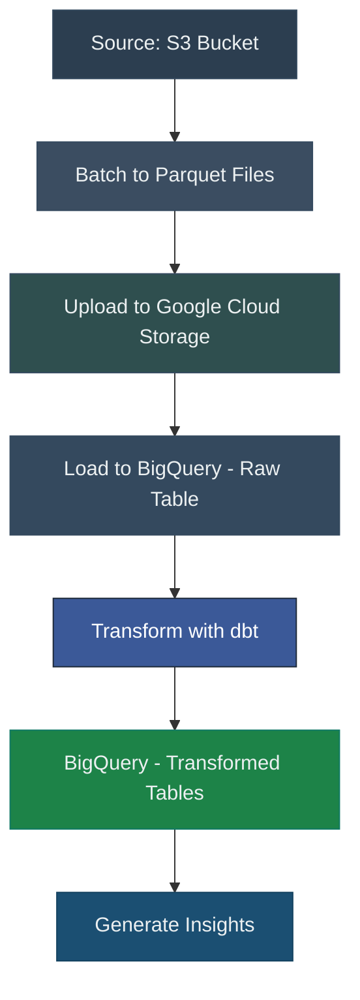

# 📚 **Kindle Reviews Data Pipeline Challenge**

**Problem**: As e-commerce platforms grow, they generate massive amounts of data, such as product reviews. Efficiently processing and analyzing this data is essential for deriving insights, understanding customer sentiments, and improving decision-making.

**Goal**: Build a robust, scalable ETL pipeline to:
- Ingest raw Kindle reviews data from an S3 bucket.
- Transform the data to identify key insights, such as:
  - Best products.
  - Worst products.
  - Trending products in the last 7 days.
  - Products with more than 30% bad reviews over the last 30 days (flagged for review).
- Load the raw data into BigQuery and use **dbt** to model and transform it into actionable insights.


## **Pipeline Overview**

The pipeline consists of:
1. **Ingesting raw Kindle reviews data** from an S3 bucket.
2. **Batch processing the data** by splitting it into manageable Parquet files.
3. **Loading the Parquet files into Google Cloud Storage (GCS)**.
4. **Using the BigQuery operator** to load the raw Parquet files into BigQuery.
5. **Using dbt to transform the raw data in BigQuery**, producing insights such as:
   - Best products.
   - Worst products.
   - Trending products in the last 7 days.
   - Products flagged for having over 30% bad reviews in the last 30 days.





## 📋 **Steps to Complete the Challenge**

### **1. Get the Dataset**

- Download the Kindle Reviews dataset from Kaggle:  
  [Kindle Reviews Dataset](https://www.kaggle.com/datasets/bharadwaj6/kindle-reviews)  
- Ensure the dataset is uploaded to your S3 bucket in the folder path defined by your pipeline.


### **2. Set Up Environment**

1. **Docker Setup**:

- **Obtain the Latest Airflow Docker Image**:
  - The Apache Airflow community provides production-ready Docker images for various Python versions. You can find these images on Docker Hub:
    - [apache/airflow:latest](https://hub.docker.com/r/apache/airflow): The latest released Airflow image with the default Python version
    - [apache/airflow:latest-pythonX.Y](https://hub.docker.com/r/apache/airflow): The latest released Airflow image with a specific Python version (replace `X.Y` with the desired version, e.g., `3.7`).

- **Set Up Airflow with Docker Compose**:
  - Use the provided `docker-compose.yaml` file to set up Airflow, PostgreSQL, Redis, and dbt.
  - Before running the services, ensure that your `docker-compose.yaml` file references the desired Airflow image. For example:
    ```yaml
    services:
      airflow:
        image: apache/airflow:latest
        # ... other configurations ...
    ```
  - Run the following commands to build and start the services:
    ```bash
    docker-compose build
    docker-compose up -d
    ```
  - Access the Airflow web UI at [http://localhost:8080](http://localhost:8080).

**Note**: Ensure that your Docker installation allocates sufficient resources (at least 4GB of memory) to handle Airflow and its associated services efficiently. For more detailed information on running Airflow with Docker, refer to the [official Airflow documentation](https://airflow.apache.org/docs/apache-airflow/stable/howto/docker-compose/index.html).


2. **Google Cloud Setup**:
   - Configure a GCS bucket for storing Parquet files.
   - Set up a BigQuery project and dataset.
   - Provide the necessary credentials in `gcp_credentials.json` and link it to your Airflow instance.

3. **AWS S3 Setup**:
   - Ensure the Kindle reviews CSV is available in the configured S3 bucket path.


### **3. Build the ETL Pipeline**

#### **DAG 1: S3 to GCS to BigQuery**

1. **Ingest Data**:
   - Use the `S3Hook` in Airflow to pull the raw Kindle reviews CSV from S3.

2. **Batch Process Data**:
   - Split the raw CSV file into manageable Parquet files using batch processing.
   - Ensure each Parquet file contains a consistent number of rows for efficient downstream processing.

3. **Load Data to GCS**:
   - Upload the batched Parquet files to a designated folder in your GCS bucket.

4. **Load Data into BigQuery**:
   - Use the `GCSToBigQueryOperator` in Airflow to load the raw Parquet files from GCS into a raw table in BigQuery.

5. **Clean Up**:
   - Delete the original CSV file from S3 after successful ingestion and ensure intermediate files are cleaned up to save storage costs.

#### **DAG 2: BigQuery Transformations with dbt**

1. **Transform and Analyze with dbt**:
   - Use dbt to transform the raw BigQuery table and generate insights such as:
     - **Best Products**: Products with the highest average ratings and a significant number of reviews.
     - **Worst Products**: Products with the lowest average ratings.
     - **Trending Products**: Products with an increase in reviews over the last 7 days.
     - **Flagged Products**: Products with more than 30% bad reviews (ratings ≤ 2) in the last 30 days.

2. **Schedule dbt Models**:
   - The `dbt_pipeline.py` Airflow DAG will execute all dbt models weekly to ensure data is up-to-date for analysis.


## 💡 **Expected Output**

1. **BigQuery Raw Table**:
   - A clean raw table in BigQuery containing the unprocessed Kindle reviews data.

2. **BigQuery Processed Tables**:
   - Aggregated insights on:
     - Top-rated products.
     - Worst products.
     - Emerging product trends.
     - Products with consistent customer complaints.

3. **Documentation**:
   - Comprehensive documentation of your pipeline and workflows for easy replication.


## 🚀 **Bonus Challenge**

1. **Data Validation**:
   - This data set is clean, but future proof it with steps in the pipeline to validate raw data before processing it.
   - Ensure schema consistency and handle missing/invalid values.

2. **Visualization**:
   - Use tools like Looker or Streamlit to create dashboards and visualize insights.

3. **Hyperscalability**:
   - Optimize BigQuery by implementing table partitioning and clustering.
